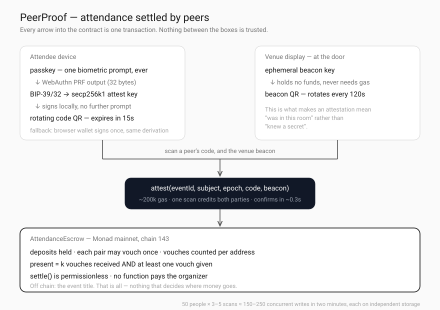

# PeerProof

**Attendance you don't have to trust the organizer for.**

Attendees stake a deposit to register for an event. At the venue they attest to each other — the room proves itself — and the contract settles automatically: everyone confirmed present reclaims their deposit and splits the deposits forfeited by no-shows. The organizer has no function that releases, withholds, or receives a single wei.

Built for [Monad Metropolis](https://www.monad.xyz/developers/hackathons/metropolis) · Track: Consumer Products & Payments

**Live:** [zhxinyue29.github.io/peerproof](https://zhxinyue29.github.io/peerproof/) · **Contract:** [`0x6Dcaa43a0b6eBB82A4117b2c0eF28f246f345E2b`](https://testnet.monadscan.com/address/0x6Dcaa43a0b6eBB82A4117b2c0eF28f246f345E2b) on Monad testnet (10143), source verified

### Trying it

Sign in with an email — no wallet, no extension, nothing to install. You will need a little testnet
MON to put down a deposit; the app does not offer to fetch it for you, because claiming test tokens
is not part of the product. Get some from the [Monad faucet](https://faucet.monad.xyz) or the
`#faucet` channel in [Monad's Discord](https://discord.gg/monad), send it to the address the app
shows you, and register.

Two accounts are needed to see the mechanism work: the contract refuses self-attestation, so one
person scanning their own code proves nothing. Two phones, or a phone and a browser wallet.

---

## The problem

Free RSVP costs nothing to abandon. Monad Blitz has run in 50+ cities since May 2025 — ask any of those organizers how many RSVPs walked through the door, and how much room and catering they had already committed to the number on the signup page.

Deposit-forfeiture is the obvious fix, and it has been tried twice:

| Prior art | Status | How attendance is decided |
|---|---|---|
| [Kickback](https://github.com/wearekickback/contracts) | 2018, sunset 2023 | Admin submits attendance bitmaps |
| [Unlock "I'm Going"](https://unlock-protocol.com/guides/unlock-commitment-staking-kickback-refund/) | 2024, beta | Lock manager publishes a Merkle root |

**Both settle on the organizer's word.** An organizer can simply mark nobody as present and keep the pot. Kickback's own [self-audit](https://github.com/wearekickback/contracts/blob/master/doc/SelfAuditV084.md) concedes that "event owners possess extensive authority to designate attendance, enabling selective exclusion of disliked participants."

Unlock's announcement says forfeited funds could "in the future, even be shared with the attendees who did attend." That is the part nobody built.

## What's different here

Attendance is established by peers, and settlement needs no one's permission.

```
Organizer creates event      deposit / capacity / k / window / venue beacon key
        │                    ...and gets no spending power of any kind
        ▼
Attendee registers           stakes the deposit, registers an attest key
        │                    derived from their passkey's WebAuthn PRF output
        ▼
Attendee checks in           scans the door screen, whose beacon rotates every 30s, and
        │                    spends it immediately — the chain timestamps the arrival
        ▼
Peers scan each other        each attendee displays a code that rotates every 15s;
        │                    one scan = one transaction = +1 credit for BOTH parties,
        │                    so a room of N reaches quorum in O(N) transactions
        ▼
Presence established         k credits received AND at least one attestation given
        │
        ▼
Window closes → settle()     callable by anyone; no privileged party exists
        │
        ▼
Payouts                      present: deposit + share of forfeited pool
                             no-show: deposit forfeited
                             nobody confirmable: everything refunded, no verdict issued
```



### Why an attestation proves presence

Three constraints stack:

1. **The peer code changes every 15 seconds** and is accepted for four epochs, so it is worth something for the minute in which it is read and worthless after — a screenshot forwarded to someone at home included.
2. **Checking in spends a live venue beacon in its own transaction**, so whoever did it read a display in the room, at a moment the chain — not the submitter — recorded.
3. **Being confirmed requires having submitted an attestation yourself**, and attesting requires having checked in. This is the important one: every account that settles as present came through the door. You cannot be relayed in by a friend.

Without (3), three confederates on site could farm unlimited remote accounts. With it, presence is non-transferable.

Arrival and vouching are deliberately on separate clocks. An earlier version put the beacon signature on every attestation, which made the venue's 2-minute rotation a deadline for finding, greeting and scanning another human — a constraint the mechanism never needed and a room full of people cannot meet. A beacon signature carries no proof of when it was read, so the only honest way to date one is to make reading it a transaction; having done that once, nothing later in the evening has to touch the venue again.

## Why Monad

This is not "Monad is faster, so it's nicer." The mechanism does not work on a slow chain.

| Requirement | Monad | On a 12-second chain |
|---|---|---|
| 50 people × 3–5 scans ≈ **150–250 concurrent transactions in two minutes**, each touching independent storage | Parallel execution, no contention. At ~200k gas per attestation and a 150M block limit, one block absorbs ~750 attestations | Congestion and fee auctions during the burst |
| Scanning must confirm in **under a second** or users re-scan and think it broke | 300ms blocks (MIP-12) | 12s of standing still, so you batch offchain — which reintroduces a server you have to trust, and the mechanism collapses |
| Codes expire in 15s, so confirmation must beat expiry with margin | 300ms finality | Confirmation slower than the code's lifetime |

The rotating code is what makes this proof-of-presence rather than proof-of-knowing-a-secret, and short expiry only works if confirmation is faster than expiry. **Latency is not a UX detail here; it is load-bearing.**

## Design decisions worth defending

**Presence uses a naive threshold, not a K-core.** The formally correct set is the K-core of the attestation graph — the largest set where every member has ≥ k attestations from within it. It is unique and computable in O(V+E), but nobody computes global graph properties onchain (BrightID runs its analysis offchain; Circles UBI only ever does path-finding). We keep an O(1) counter per attendee. The venue beacon is the real sybil defense; graph analysis would be defense in depth.

**The organizer fallback is locked in healthy rooms.** `organizerCheckIn` reverts whenever peers confirmed more than k attendees. It only unlocks when the room was too small to prove itself — degrading to the trust model of the existing art, never worse than it. Even then the organizer cannot receive funds; the worst they can do is misattribute presence among addresses that already staked.

**Settlement is permissionless, with a grace period.** `settle()` can be called by anyone once the window closes, so no party can withhold payouts. But a griefer calling it the instant the window shut would lock in zero confirmations and strand the handful who came, so rooms that still need the fallback wait out a one-hour grace period first.

**No verdict beats a bad verdict.** If nobody can be confirmed present, every deposit is refunded rather than distributed on weak evidence. The organizer captures nothing in this branch either.

**Rounding dust stays in the contract.** `forfeited / confirmed` truncates, leaving up to `confirmed - 1` wei. Kickback swept its remainder to the organizer; that is precisely what this design cannot do.

**One person turning up is a win, not an edge case.** If a single attendee shows, peers can establish nothing — so the fallback confirms them and they take the entire forfeited pool: ten times their own stake, in a ten-person event. The person who honoured the commitment must never be the one who loses, and `test_soleAttendeeTakesWholePool` pins that. The residual is honest: this branch needs the organizer to check them in, and if the organizer never acts, nobody is penalised and every stake is returned.

## Revenue

A cut of **forfeited** deposits only — never of a stake that returns to someone who showed up. The fee is earned exactly when the mechanism did work, and an attendee's principal is never touched. Precedent: Unlock's DAO voted a 1% protocol fee switch onto the same shape of contract.

Deliberately **not implemented in V1**. A fee recipient is a privileged address, and "no privileged parties" is the entire differentiator; adding one to win a line on a slide would be a bad trade.

## Limitations

Stated plainly, because they are real:

- **Onchain proof of physical location is an open problem.** The venue beacon raises the cost of remote collusion from zero to "at least one confederate must physically attend and relay a beacon inside its 30-second epoch, once per remote account." It does not eliminate it. NFC/UWB attestation is future work.
- **The deposit must be the user's own money.** Fiat onramps are out of scope, so V1 targets attendees of IRL crypto events who already hold MON but still resent extensions, seed phrases, and gas prompts. Passkey accounts remove the wallet friction, not the funding requirement.
- **WebAuthn PRF is not universally available.** Chrome desktop's local-profile authenticator exposes no PRF at all. The app capability-detects and falls back to a connected wallet.
- **Passkey loss means fund loss.** No recovery mechanism is implemented.
- **Economics are a commitment device, not a yield.** Payouts come from no-shows, so a well-attended event pays almost nothing out — that is the mechanism succeeding, not failing. The value to an organizer is turnout, not returns.

## Surfaces

| Route | What it is |
|---|---|
| `/` | The link an attendee arrives on. Deposit, projected payout, one button to stake it. |
| `/floor` | **The ten minutes that matter.** Your rotating code, a scanner, your vouch count, the on-chain latency of every attestation, and the settlement panel once the window shuts. |
| `/venue` | Goes on a laptop or spare phone at the door. Displays the rotating beacon that attendees check in against on arrival. |
| `/organizer` | Create an event, watch registrations — and find no button that pays anybody. |
| `/verify` | Public, no key needed. The attestation graph and the settlement arithmetic, rebuilt from chain events. |

`/verify` exists because a claim that nobody has to be trusted is worth nothing if the only way to check it is to believe our own interface. Every line in the graph is one transaction; every figure in the arithmetic is derived rather than reported.

## Two ways in

**Passkey (default).** WebAuthn PRF output → BIP-39/32 → a secp256k1 key that signs the rotating codes. One biometric prompt, ever. That is the only reason a fifteen-second rotation is tolerable: after setup, signing is silent.

**Browser wallet (fallback).** One `personal_sign` → the same derivation → the same kind of key. Needed because Chrome's built-in desktop authenticator exposes no PRF at all, so a laptop cannot use the passkey path. The wallet then confirms each attestation, which is worse — and that friction is exactly what the passkey path removes.

The contract separates the registered address from the key that signs codes, and that separation is what makes the fallback possible: on the wallet path the wallet is the participant and the derived key is only the code signer.

## Contracts

`src/AttendanceEscrow.sol` — the whole thing. No proxies, no external dependencies beyond `forge-std` for tests. 66 tests, including a parity test that pins both message digests against the values `viem` computes in the frontend — if those encodings ever drift, every attestation at the venue reverts and the failure is unreproducible on a laptop.

Measured under Monad execution rules (`network = "monad"`, which applies Monad's opcode repricing) at the 102 gwei both networks were quoting. The right-hand column prices the **limit** the app actually sends, not the average, because Monad bills the limit:

| Function | Gas avg / max | Limit sent | At 102 gwei |
|---|---|---|---|
| `attest` | 186,104 / 240,991 | 250,000 | ≈ 0.026 MON |
| `register` | 92,577 / 92,861 | 110,000 | ≈ 0.011 MON |
| `claim` | 74,275 / 83,861 | 100,000 | ≈ 0.010 MON |
| `checkIn` | 74,958 / 78,647 | 90,000 | ≈ 0.009 MON |
| `settle` | 47,071 / 54,071 | 70,000 | ≈ 0.007 MON |
| `createEvent` | 118,128 / 122,143 | 140,000 | ≈ 0.014 MON |

At a 30 MON deposit — the intended production figure, about five dollars at the time of writing — a
participant's whole evening (register, check in, three attestations, claim) is roughly **0.36% of
their stake**.

The deployed demo runs on **testnet with a 1 MON deposit and k = 2**, for two reasons worth stating
plainly rather than hiding: testnet MON comes from a faucet in single digits, so a 30 MON stake
across six accounts is not obtainable; and k = 2 is the highest threshold three devices can satisfy
(N people vouching for each other give everyone N−1 vouches, so k = 3 needs four). Testnet MON also
has no market price, so the app shows MON only there — quoting a dollar figure would be inventing
one.

## Build

```bash
cd contracts && forge test          # 38 tests
forge test --gas-report
```

Run the whole product against a local chain — real transactions, no real money:

```bash
anvil --block-time 1 &
scripts/dev-chain.sh                # deploy, open an event, register a few attendees
scripts/dev-attest.sh 4             # optional: have them vouch for each other
cd web && npm install && npm run dev
```

`dev-chain.sh` writes `web/.env.local` with the deployed address. The floor screen carries a dev
panel on a local chain — fund the derived key, warp the chain into the attestation window, read the
beacon without a camera — so the full loop is exercisable on one machine.

Deploy. Swap `monad_testnet` / `10143` for `monad` / `143` to go to mainnet:

```bash
cast wallet import monad-deployer --interactive
forge script script/Deploy.s.sol:Deploy --account monad-deployer \
  --rpc-url monad_testnet --broadcast --gas-limit 2800000
```

2,800,000 is pinned rather than estimated: the deployment measures 2,370,395 gas, and the
difference is deliberate headroom. It is not free — Monad bills the limit — but a deployment that
runs out of gas is billed the limit too, and then has to be paid again.

`AttendanceEscrow` and `EventDirectory` are deployed separately, and the directory takes the escrow
address as an immutable constructor argument. A new escrow therefore needs a new directory — which
the organizer screen deploys from the browser through the CREATE2 factory, so its address follows
from the bytecode and needs no configuration.

Verification via Sourcify needs no API key:

```bash
forge verify-contract <address> AttendanceEscrow --chain 10143 \
  --verifier sourcify --verifier-url https://sourcify-api-monad.blockvision.org/
```

> Monad charges gas on the gas **limit**, not gas used. Pin limits explicitly; do not estimate and pad.

## Stack

| Layer | Choice |
|---|---|
| Chain | Monad mainnet, chain ID 143 |
| Contracts | Solidity 0.8.28, Foundry |
| Accounts | [Mera](https://mera.category.xyz/) — passkey → WebAuthn PRF → secp256k1, no seed phrase, no extension, no custody backend. Browser wallet as fallback. |
| Indexing | Chunked `eth_getLogs` today; [Envio HyperIndex](https://envio.dev/chains/monad) next — Monad's default RPC caps `getLogs` at 100 blocks and a ten-minute window spans ~2,000 of them |
| Frontend | Next.js, viem (`monad` is a built-in chain) |

No bundler, no EntryPoint, no paymaster. Mera yields a plain EOA, target users already hold MON, and "never see a gas prompt" comes from signing locally rather than from sponsorship. Every mainnet paymaster charges for mainnet sponsorship, and none of that spend would have bought anything the local signature does not already give.

## License

MIT
