# PeerProof 产品说明（给设计师）

写给接手视觉设计的人。每一屏都有手机版和电脑版截图、这一屏存在的理由、每个输入框和模块的含义。

截图在 `docs/screens/`，文件名规则 `序号-页面-mobile/desktop.png`。手机 390×844，电脑 1280×900，**都是真实链上数据渲染的**，不是占位图。

**图上的粉红色编号**（①②③…）和每节的模块表一一对应——看到表里写「③」，直接在图上找那个圈就行。

---

## 一、这个产品在做什么

活动报名时交一笔押金。到了现场，参与者**互相扫码作证**，合约自动结算：被证明到场的人拿回押金，**外加缺席者押金的分成**。

**主办方没有任何一个函数可以放款、扣款或收款。** 这是整个产品的立足点——不是「我们承诺不作恶」，是「代码里没有作恶的入口」。

### 为什么扫码能代表「到场」

三重约束叠加：

1. **对方的码 15 秒一换** —— 截图转发过去，两轮就废了
2. **到场签到必须当场花掉一个活着的场地信标** —— 会场屏幕上的码 30 秒一换，签到会立刻把它发上链，所以「什么时候到的」是链自己记的，不是用户说的
3. **要被确认到场，你自己必须也给别人作过证** —— 而作证的前提是签过到。所以每个被判定到场的账号，都真的进过那扇门

远程串通不是不可能，但代价从零变成了「至少得有一个同伙真的到场，并且在 30 秒内把码实时转发出去，每开一个远程账号就得来一次」。

**到场和作证是两个独立的时钟，这是刻意的。** 早先的版本要求每一次见证都附带场地信标，等于给「在人群里找到一个人、打招呼、等对方掏手机开 App、把码举到镜头前」这件事设了个两分钟的死线——机制本身从来不需要这个约束，而一屋子人也做不到。签到一次之后，整晚再也不用看会场大屏。

---

## 二、两扇门

**首页不是活动页，是一个岔路口。**

```
                    /  首页
         这是什么 + 你现在是哪种身份
                   ╱        ╲
      「我要去参加」          「我要办活动」
            ↓                    ↓
      /events 活动列表      /organizer 主办方后台
            ↓                    ├─ 我创建的活动
      /event 活动详情            ├─ 当前活动看板
            ↓                    └─ 建新活动
      /floor 签到                      ↓
                              /venue 会场信标屏
```

**为什么要分开。** 原本两种身份走同一套页面：办活动的人一按返回，就掉进参与者的活动列表——**满屏都是别人的活动，找不到自己那个**；而参与者误入主办方页面，看到的是一个自己只是报了名的活动的管理台。

**同一个账号可以两种身份都是**，同一天都可能。**但它不能在没有明说的情况下同时是两种。** 所以先选门。

| 路由 | 谁用 | 在什么设备上 |
|---|---|---|
| `/` | 所有人的入口 | 都可以 |
| `/events` → `/event` → `/floor` | **参与者** | 手机 |
| `/organizer` | **主办方** | 电脑 |
| `/venue` | **会场** | 笔记本或投影，摆在门口 |
| `/verify` | **任何人**，不用登录 | 都可以 |

**旧链接仍然有效**：`/?event=12` 会自动跳到 `/event/?event=12`。别人手机里存着的邀请链接不能因为我们改结构就失效。

---

## 三、逐屏说明

### 0. 首页 `/` —— 两扇门

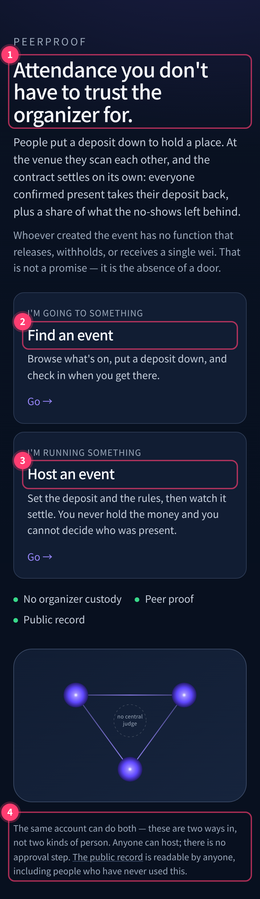
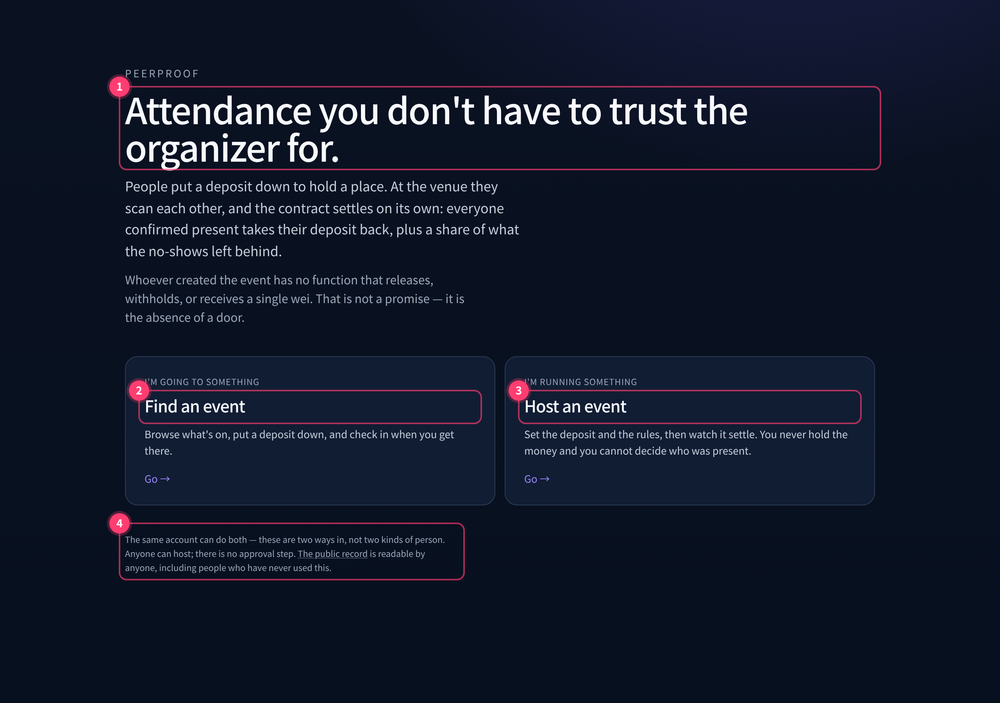

**这一屏回答**：这是什么，以及我现在是哪种身份。

| # | 模块 | 内容 |
|---|---|---|
| ① | 主标题 | 「Attendance you don't have to trust the organizer for.」——**这是整个产品的一句话** |
| ② | 左门 | 「I'm going to something」/ **Find an event** |
| ③ | 右门 | 「I'm running something」/ **Host an event** |
| ④ | 底部说明 | 「同一个账号可以两种身份都是——这是两个入口，不是两类人」+ 公开记录链接 |
| — | 右侧插画 | 三个互连的点，**中间是一个空的虚线圈，写着 `no central judge`** |
| — | 三点一行 | No organizer custody · Peer proof · Public record |

**设计要点**

**两扇门要等重。** 不能把「办活动」做成次要按钮——这个产品的供给侧和需求侧一样重要，而且任何人都能办，没有审核。

**标题下面那两段是产品主张，别删也别缩**。尤其最后一句：「**这不是一个承诺，而是一扇门的缺席**」——它说的是主办方拿不到钱不靠信任，靠代码里根本没有那个函数。

**那张插画不是装饰，是论证。** 三个节点两两相连，中间那个位置——同类产品通常放自己的 logo，放那个仲裁者、那个托管方、那个你必须信任的公司——**是空的**。这个缺席就是全部主张。它用一张图说完了旁边两段话在说的事。

纯 CSS + 一个 SVG，没有图片文件，不会过期，给多大的框就撑多大。

**这一屏没有登录。** 选门之前不需要任何身份。

### 1. 活动列表 `/events` —— 首页

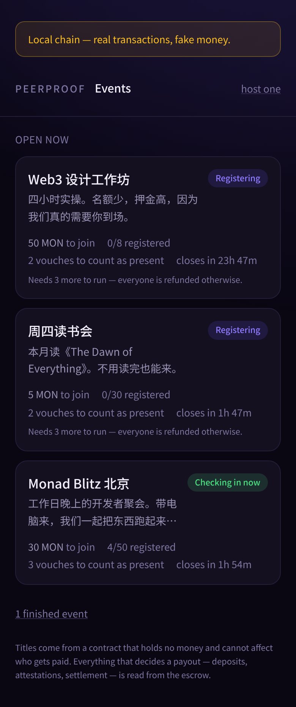
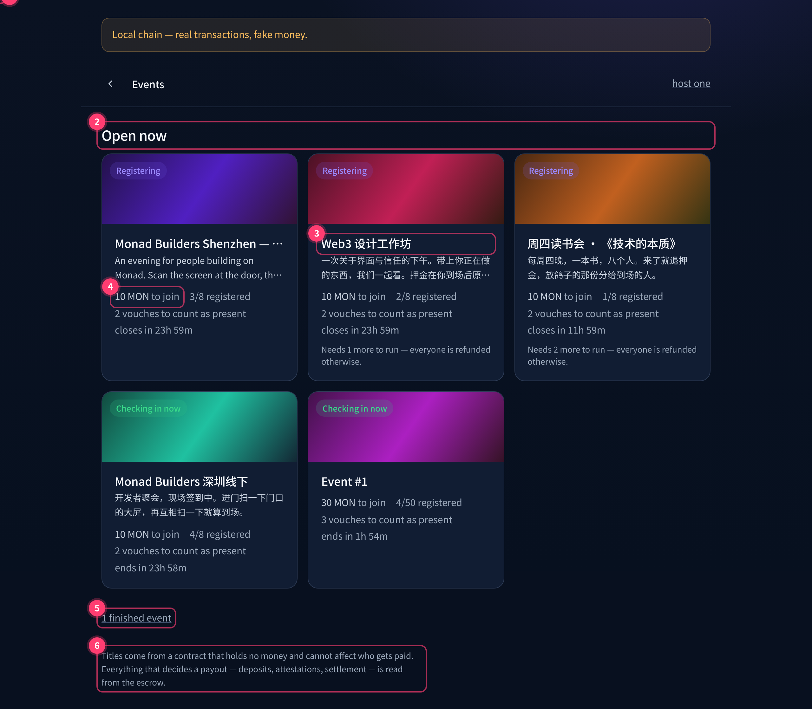

**这一屏回答**：现在有什么活动可以参加。

**模块**

| # | 模块 | 说明 |
|---|---|---|
| ① | 顶栏品牌 + `host one` | `host one` 去主办方后台。**任何人都能办活动，没有审核** |
| ② | 分区标题 `OPEN NOW` | 只有能参加的排在这里 |
| ③ | 活动卡片 | 整张卡可点。**顶部有一条彩带**，颜色从活动号派生 |
| ④ | 卡片数据行 | 押金 / 已报名 / 需要几次见证 / 倒计时 |
| ⑤ | 已结束折叠区 | **收起但不删除**——公开记录是这个产品的论据，藏起来等于藏证据 |
| ⑥ | 底部说明 | 解释为什么标题可以随便写也不影响钱 |

**状态标签六种**

| 标签 | 含义 | 能否报名 |
|---|---|---|
| `Registering` | 报名中，还没开场 | ✅ |
| `Starts soon` | 报名已截止，等开场 | ❌ |
| `Checking in now` | 正在签到 | **看主办方设置** —— 见下 |
| `Finished` | 结束，等结算 | ❌ |
| `Cancelled — refunded` | 人数不足，全额退款 | ❌ |
| `Settled` | 已结算 | ❌ |

⚠️ **「标签 = 能不能报名」这个等式不成立，这是这一屏最容易搞错的地方。**

主办方勾了 **Take walk-ins**（见第 5 屏「现场加入」开关）的话，报名会一直开到活动结束。所以一个 `Checking in now` 的活动**可能还在收人**。这两件事是独立的，**不能用一个标签表达**。

所以卡片上会多出一行绿色文案：

> ✅ **Check-in has started — you can still join.**

**这行在截图里看不到**——截图跑在本地测试链上，那条链上的合约是改「现场加入」之前的版本，造不出「签到中且仍可报名」的活动。**设计时要按它存在来做**，它在测试网上是真的会出现的（当前线上活动就是这个状态）。

**这行是整个列表页唯一能告诉路人的、他自己猜不到的信息**——「我路过看到这个活动，现在进去还来得及」。这正是「现场加入」这个功能存在的理由。设计上别把它做成次要注释。

**卡片上的四项数据**

- `0.01 MON to join` —— 押金
- `1/6 registered` —— 已报名 / 上限
- `1 vouches to count as present` —— 需要几个人给你作证
- 倒计时 —— **报名中**显示 `closes in 1d 4h`（离报名截止）；**签到中**显示 `ends in 2d 23h`（离活动结束）

还有一行条件文案：`Needs 3 more to run — everyone is refunded otherwise`。**人数不够会全额退款**，这句消除报名者的顾虑。

**那条彩带为什么是渐变不是图片。** 设计稿里每张卡有一张配图，而**链上没有图可取**——合约只存标题和简介，配张图库照片等于在屏幕上放一个没有依据的东西。渐变从活动号算出来，给了列表需要的节奏，同时对「链知道什么」保持诚实；而且**同一个活动永远是同一个颜色**，第二次来还认得出。

**设计要点**：这是产品门面。卡片密度、状态标签的视觉权重、空状态的样子，都在这一屏定调。桌面上是三列，手机上单列。

---

### 2. 活动详情 `/event?event=N` —— 未登录

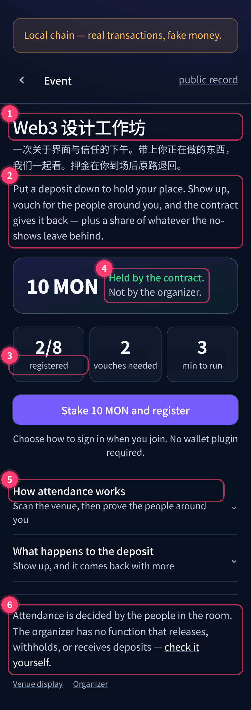
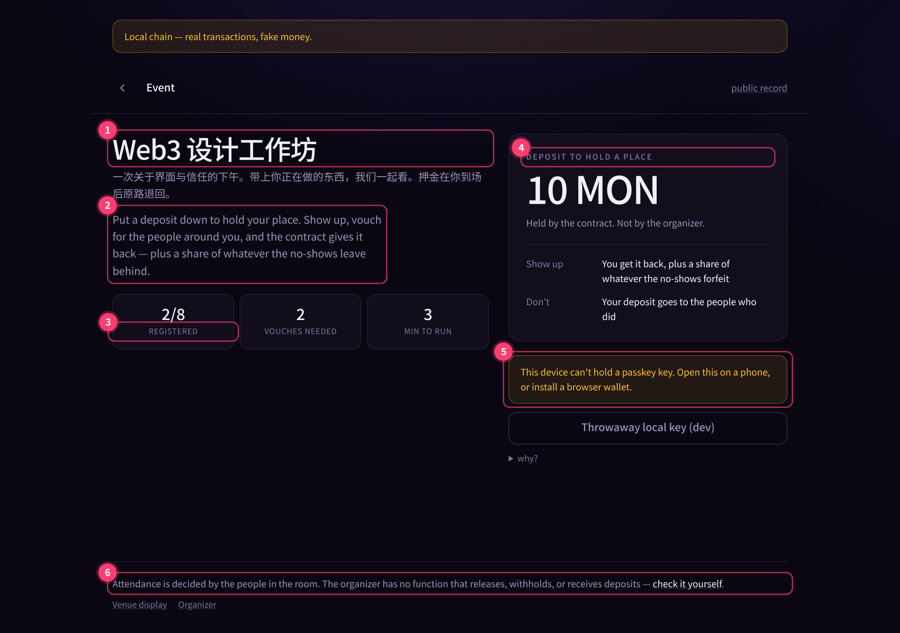

**这一屏回答**：这个活动是什么，押多少钱，规则是什么。

**模块**

| # | 模块 | 内容 |
|---|---|---|
| ① | 标题 + 简介 | 链上读的，主办方写的 |
| ② | 固定说明 | 「押一笔钱占位。到场、给周围的人作证，合约把钱还你——外加缺席者留下的那份」 |
| ③ | 三个数字块 | 已报名 / 需要几次见证 / 最低开办人数 |
| ④ | 押金卡 | 大字押金额 + 「由合约持有，不是主办方」+ 到场/缺席两种结果 |
| ⑤ | **身份选择区** | 见下。截图里是**降级状态**（无头浏览器没有 passkey），正是需要设计的那个 |
| ⑥ | 底部 | 「到场与否由房间里的人决定，主办方没有任何函数能放款、扣款、收款——**自己去查**」 |

**身份选择区**（未登录时）

三条路，按「对多少人有用」排序：

1. **`Create my key`** —— passkey（刷脸/指纹）。**体验最好**：一次授权，之后全程无弹窗
2. **`Continue with email`** —— 邮箱登录，Privy 自动创建钱包。**唯一不需要任何前置条件的路**。弹出的框**只有邮箱输入**——曾经它同时列出「连接钱包」，而页面上本来就有单独的钱包按钮，点「邮箱登录」却弹出钱包选择，是个误导
3. **`Use a wallet`** —— 已有 MetaMask 的人

**设计要点**：第 1 条不是所有设备都支持（桌面 Chrome、UC 浏览器都没有 WebAuthn PRF）。检测不到时这一屏会变成黄色提示 + 邮箱按钮优先。**这个降级状态要设计，它出现的频率不低。**

---

### 3. 活动详情 —— 已登录

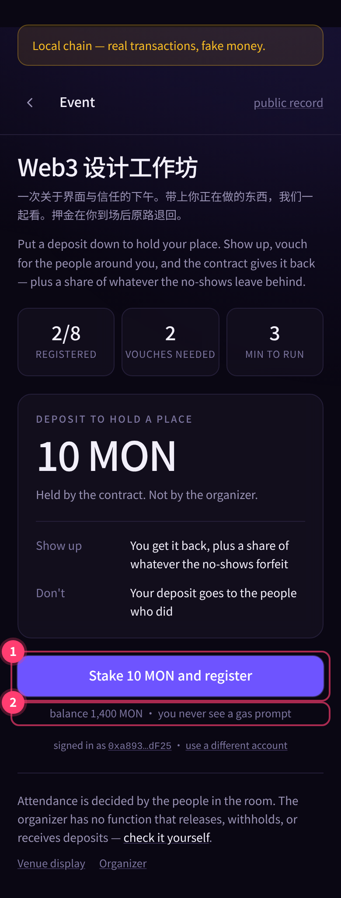
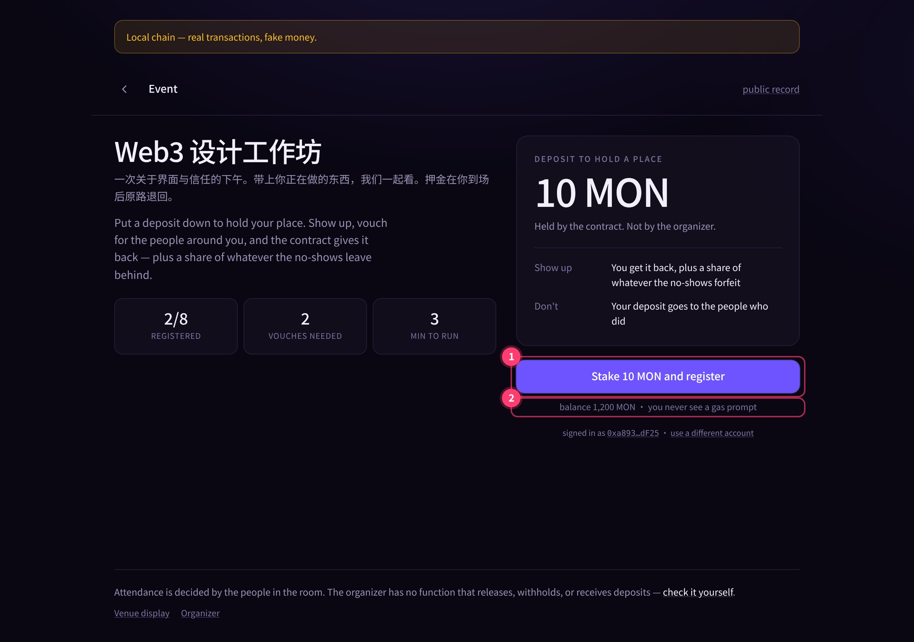

登录后身份选择区变成**一个主按钮**：

| # | 模块 | 内容 |
|---|---|---|
| ① | 主按钮 | `Stake 10 MON and register` ——**金额写在按钮上**，不让人点了才知道要付多少 |
| ② | 按钮下一行 | `balance 12.3 MON · you never see a gas prompt` |

「you never see a gas prompt」是 passkey 路径的卖点——派生出的密钥静默签名，不弹窗。

登录状态下方的身份行，**邮箱登录和其他两条路显示的不一样**：

| 登录方式 | 显示 |
|---|---|
| 邮箱 | `signed in as you@example.com · use a different account`<br>下面再一行：`wallet 0x7497…a80d`（可点复制） |
| passkey / 钱包 | `signed in as 0x7399…c621 · use a different account` |

**邮箱那条必须显示邮箱。** 用邮箱进来的人**没法把 `0x7497…a80d` 和自己知道的任何东西对上**——那串号码是 app 替他生成的，而这条路的全部意义就是他不用去想钱包。地址留在下面一行，因为充值要往那里打。

**密钥会被记住**（钱包/邮箱路径一天，passkey 路径仅当前标签页），所以刷新页面不会掉登录。那个链接是唯一的退出口——同一台设备上换账号时需要它。

**这个退出口曾经是坏的，值得记一笔。** 它只清掉我们自己派生的密钥，没有结束 Privy 那一侧的会话——而 Privy 的会话存在浏览器里。结果是点了「换个账号」，再点邮箱登录，**登录框根本不弹，直接把你送回刚才那个账号**。

对这个产品来说这不是小毛病：**一个房间里的两个人必须是两个不同的账号**，否则互相作证根本无法进行。测试的人只有一台手机时第一个就会撞上。

**设计上要注意**：退出要有明确的完成反馈。现在点下去是静默的——Privy 的登出是一次网络请求，有延迟，这期间用户不知道发生了什么。**这里缺一个状态**（「正在退出…」或者退出后的一句确认），值得设计。

**余额不足时**（见第 9 屏）按钮会禁用，上方出现一块橙色提示，说明还差多少、为什么押金不能由平台代付，并给出获取途径。

**这个位置一共四种状态，设计时要一起考虑：**

| 情况 | 显示什么 |
|---|---|
| 已报名 | 绿色「You're in」+ 主按钮 `Go to the floor`（签到中）或 `Open my attendance code`（还没开场） |
| 能报名 | 主按钮 `Stake 0.01 MON and register` —— **金额写在按钮上** |
| 能报名但没钱 | 同上但禁用，上方是第 9 屏那一整块 |
| 报名已截止 | 灰色提示 `Registration for this event has closed.` |
| **名额满了** | 灰色提示 **`This event is full.`** —— 和「截止」分开说，因为是两回事 |

⚠️ **报名按钮不看「阶段」，只看「还能不能报名」。** 之前这两个是同一个判断，结果签到一开始报名按钮就消失了——**正好把「现场加入」这个功能在用户那一侧废掉了**，路过想加入的人只会看到「报名已截止」。

**交易被拒绝时**的提示也重写过。钱包抛出的是 `{code: 4001}` 这种裸对象，以前会原样显示成 `[object Object]`，看起来像产品崩了。现在是人话：

| 情况 | 文案 |
|---|---|
| 在钱包里点了拒绝 | `You rejected this in your wallet.` |
| 余额不够付 gas | `Not enough MON in this wallet to cover the gas for this transaction.` |
| 钱包里还有没处理的弹窗 | `Your wallet already has a request open — check it for a pending prompt.` |
| 实在解析不出 | `The wallet refused this without saying why.` |

**最后一条是刻意的**：读不出原因时要承认读不出，而不是把内部对象打印给用户看。

---

### 4. 主办方后台 —— 看板 `/organizer`

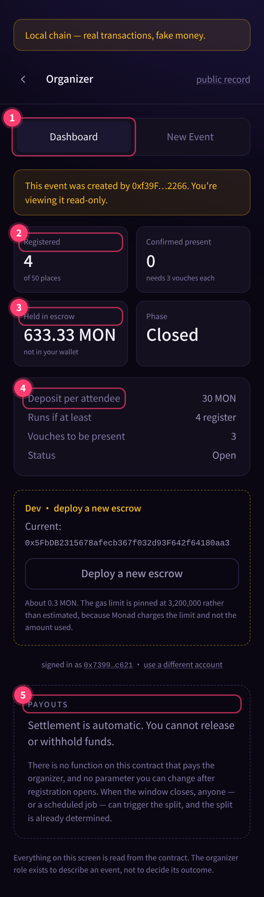
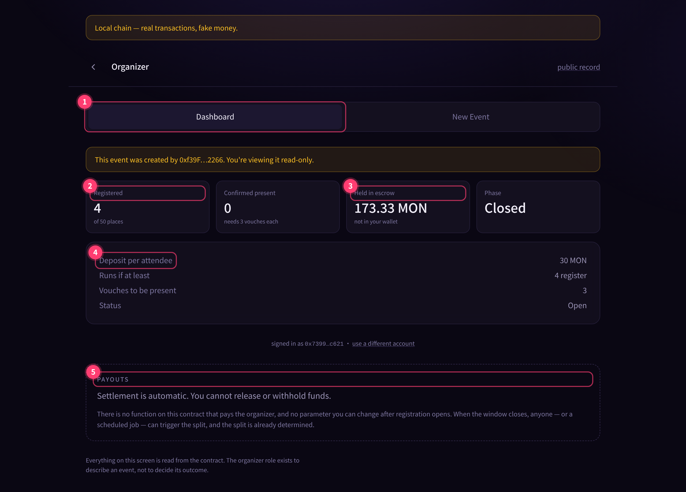

**这一屏回答**：我的活动现在什么情况。

| # | 模块 | 内容 |
|---|---|---|
| ① | 标签切换 | `Dashboard` / `New Event` |
| ② | 四个数据块 | 已报名 / 已确认到场 / 托管中的金额 / 当前阶段 |
| ③ | `Held in escrow` | 下面那行 `not in your wallet` 是核心，不是装饰 |
| ④ | 参数卡 | 押金、最低人数、需要几次见证、状态 |
| ⑤ | **描述编辑区** | 「What people see in the listing」——标题 / 简介 / 链接，**随时可改** |
| ⑦ | **YOUR EVENTS** | **只列他自己创建的活动**，当前正在看的那个高亮「showing」 |
| ⑥ | **PAYOUTS 虚线框** | 「结算是自动的。你无法放款也无法扣款」 |
| — | 兜底签到区 | **只在同伴见证失败时才出现**，截图里没有 |
| — | 只读提示 | 打开的是别人的活动时，顶部一条橙色提示，⑤ 整块消失 |

**⑦ 是这次结构调整加的。** `/events` 是**参与者**的列表——所有正在办的活动，大部分是别人的。主办方按返回掉进那里，等于把他扔进一个跟他无关的房间。**两种身份，两个列表。** 没办过活动时这里是一段空状态，说明「没有审核、没有挂牌费、押金归合约你碰不到」。

**`Held in escrow` 下面写着 `not in your wallet`** —— 这不是装饰，是整个产品要传达的核心。

**⑤ 这一块的边界，是整个产品逻辑的缩影：**

| | 能改吗 | 为什么 |
|---|---|---|
| 标题 / 简介 / 链接 | ✅ **随时改，改几次都行** | 不影响钱的去向，存在一个**不持有任何资金**的独立合约里 |
| 押金 / 名额 / 最低人数 / 见证次数 / 时间窗口 | ❌ **建完永久锁死，主办方自己也改不了** | 押金是别人的钱。按「0.01 MON、1 次见证」报名的人，不该被半路改成「0.5 MON、5 次见证」 |

建活动表单上那句 `Fixed once registration opens — including for you` 说的就是下半行。**这两组字段被刻意放在两个不同的合约里**，不是配置差异，是权力边界。

**没有标题时**这一块的文案会换成：「This event has no title yet, so it shows as a number on the events page.」——它得像一件待办事项，不像一个可选设置。

**④ 阶段块的副标题也要注意**：签到中时显示 `ends in 2d 23h · still taking walk-ins`。**两个信息，因为它们是两件事**——还剩多久，和门还开不开着。

**PAYOUTS 那个虚线框是刻意的空状态**：它描述的是「这里没有按钮」。demo 视频里有一个镜头专门停在这。**设计时别把它做成一个看起来可点的东西。**

**兜底签到区**（黄色警告块）只在「到场人数太少、同伴之间凑不够见证」时才解锁。这是**唯一**主办方的话有分量的分支，而且**依然不能让他拿到钱**。健康的活动里这一整块是不存在的。

---

### 5. 主办方后台 —— 建活动（第一步：About）

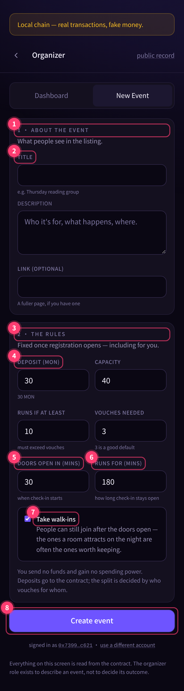
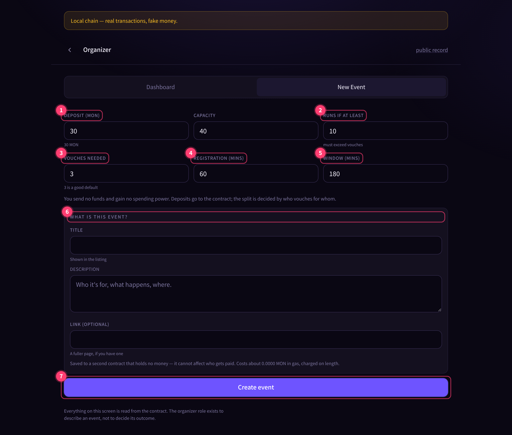

**两步，不是两块。** 原本两个模块同屏，结果**「建完永久锁死」的财务规则，和一个标题输入框在抢注意力**。一次问一件事，不可逆的那件单独占一屏。

| # | 字段 | 含义 |
|---|---|---|
| ① | 标题「About the event」 | 「What people see in the listing」 |
| ② | `TITLE` | 不填就显示 `Event #5` |
| — | `DESCRIPTION` | 最多 600 字符 |
| — | `LINK (OPTIONAL)` | |
| ③ | `Next · the rules →` | 进第二步 |

顶部有**步骤条**（1 About / 2 Rules），当前步高亮。

---

### 5b. 主办方后台 —— 建活动（第二步：Rules）

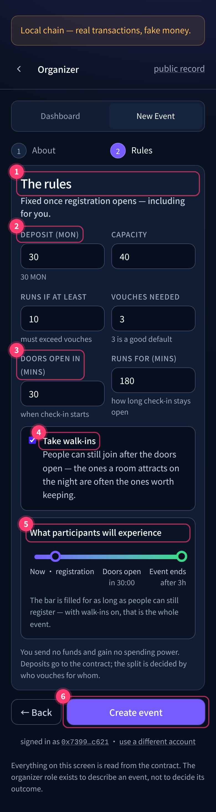
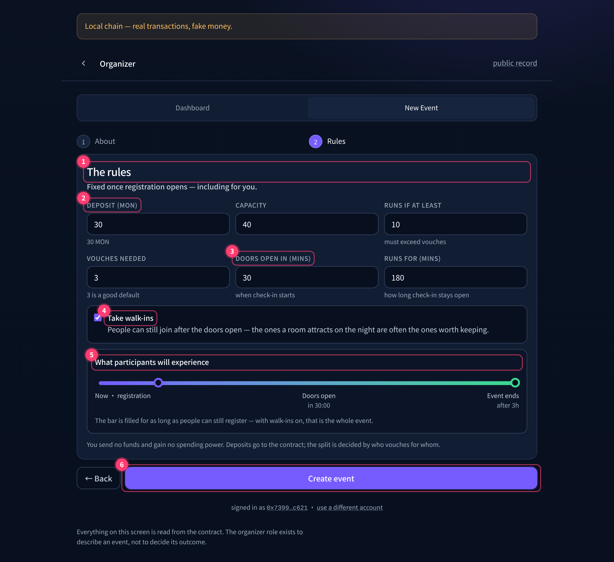

| # | 字段 | 含义 | 注意 |
|---|---|---|---|
| ① | 标题「The rules」 | 副标题「**Fixed once registration opens — including for you**」 | 这句是产品主张 |
| ② | `DEPOSIT (MON)` | 每人押金 | |
| — | `CAPACITY` / `RUNS IF AT LEAST` / `VOUCHES NEEDED` | | ⚠️ **最低开办人数必须大于见证次数**，否则合约拒绝 |
| ③ | `DOORS OPEN IN (MINS)` | 多久后开始签到 | **填 0 = 建完立刻能签到** |
| — | `RUNS FOR (MINS)` | 签到窗口开多久 | |
| ④ | ☑ `Take walk-ins` | 开场后还能不能继续报名 | 默认勾上 |
| ⑤ | **时间轴示意** | 「What participants will experience」 | **见下** |
| ⑥ | `Create event` + `← Back` | | |

**⑤ 是这一屏最重要的改动。** 三个时间字段描述的是**同一个形状**，而读的人得在脑子里把它拼出来——这是文档从第一版起就标着「最值得改进」的地方。

现在有一根进度条：**填充的部分 = 还能报名的时段**。所以把 `Take walk-ins` 一开，填充**肉眼可见地一直铺到活动结束**——这比勾选框下面那两句话有力得多。

> 勾上 —— The bar is filled for as long as people can still register — with walk-ins on, that is the whole event.
> 不勾 —— Registration closes the moment the doors open. Nobody joins after that.

**建完之后**那张卡（信标密钥 + 配置二维码）见下节。

---

### 6. 签到屏 `/floor` —— 手机专用

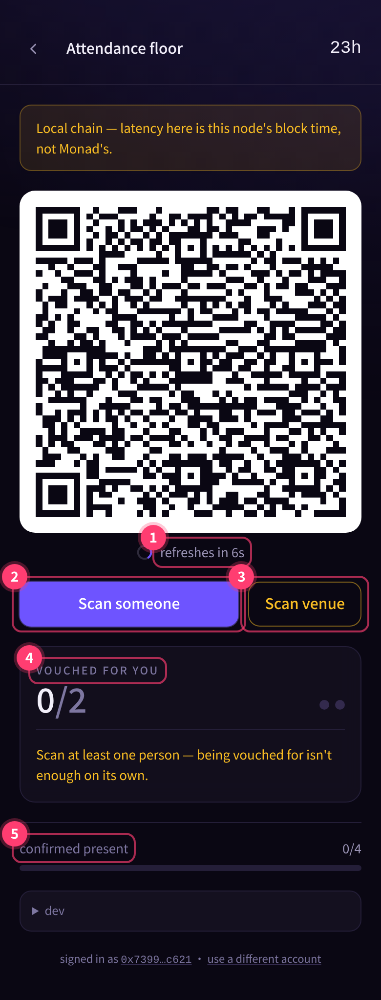
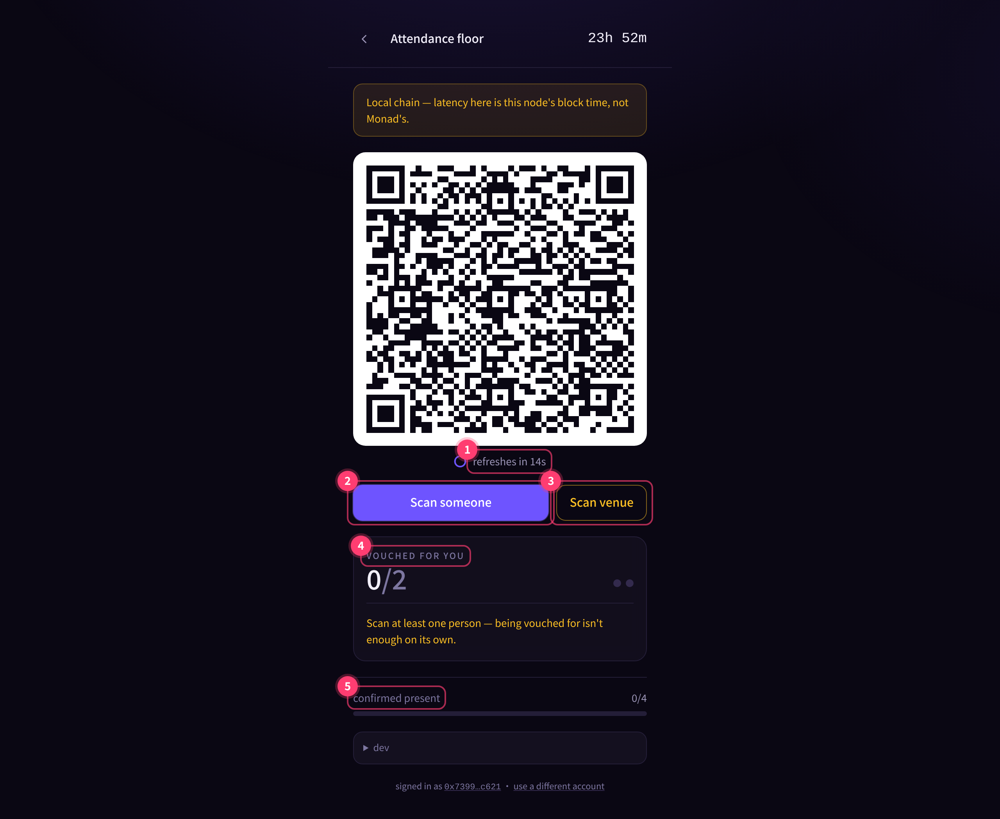

**这一屏回答**：我怎么证明我到了。

**这是唯一一个刻意锁死手机宽度的屏**——在电脑上打开也是一条窄栏，因为它只会被举在手里用。

**这一屏有前后两个状态，先后发生，不会同时出现。**

**状态 A —— 刚进门，还没签到**

| # | 模块 | 内容 |
|---|---|---|
| ① | 倒计时环 | 「refreshes in 12s」+ 走针圆环。上方是自己的二维码，**15 秒一换** |
| ② | 主按钮 `Check in at the door` | **通栏、主色**。这一刻只有这一件事可做 |
| ③ | 一句说明 | 「Point your camera at the screen at the venue. Once, when you arrive — after that you can take all evening to meet people.」 |

**状态 B —— 签到完成之后（当晚不会再变回 A）**

| # | 模块 | 内容 |
|---|---|---|
| ① | 倒计时环 + 二维码 | 同上 |
| ② | 主按钮 `Scan someone` | 通栏、主色 |
| ③ | `Checked in · 19:42` | 绿色一行字，**不是按钮**，点不动。签到时间来自链上 |
| ④ | `VOUCHED FOR YOU` | 收到几个 / 需要几个，达标后变绿 |
| ⑤ | `confirmed present` | 全场进度条 |

**为什么改成两个状态**：之前是两个按钮并排（`Scan someone` + `Scan venue`），看上去哪个都能点，于是有人先去扫人，被拒绝，再自己倒推出顺序。现在同一时刻只给一个动作。

**这里没有「场地码过期」这种状态了。** 签到是一笔独立的链上交易，一旦成功就永久有效，之后整晚都不用再看会场大屏。设计上不要再画任何「Venue ✓ / Venue 过期」的切换。

**使用环境**：站着、单手、房间光线可能很暗、摄像头开着。**触控目标 44px 起**，重要元素别贴在屏幕最底部。

---

### 6b. 签到屏 —— 还没到开场时间

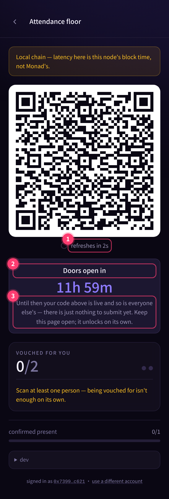
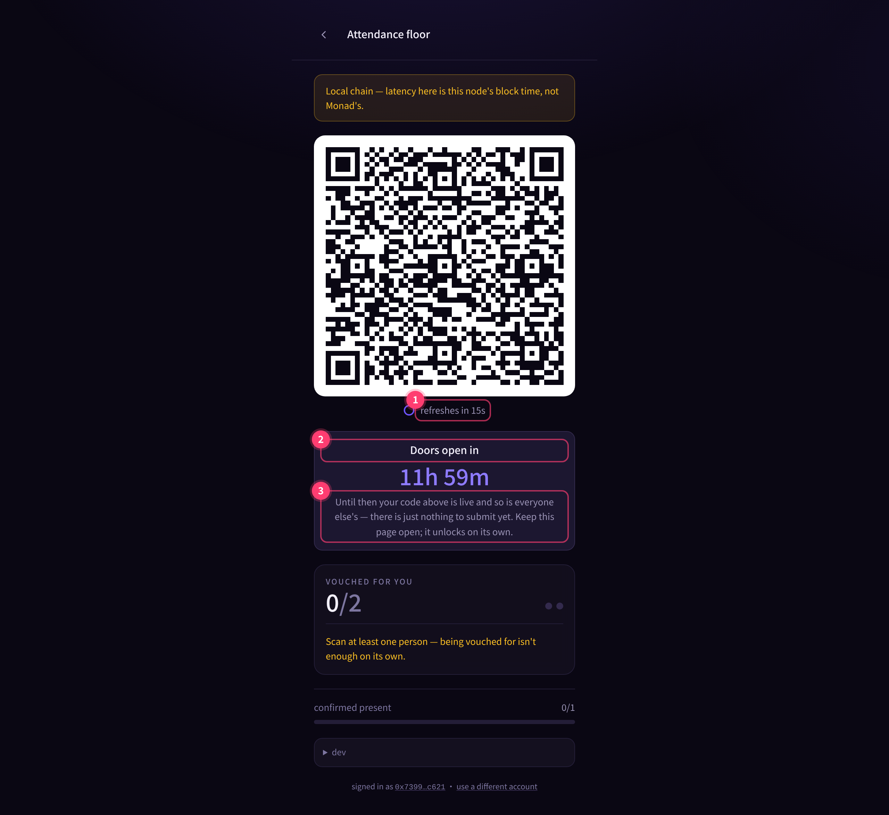

**同一个页面，早到的人看到的样子。**

| # | 模块 | 内容 |
|---|---|---|
| ① | 倒计时环 + 二维码 | **照常显示、照常轮换**。你的码现在就是活的 |
| ② | 「Doors open in」+ 大号倒计时 | 距离签到开始还有多久 |
| ③ | 一句解释 | 「Keep this page open; it unlocks on its own.」 |

**这一屏是被投诉出来的。** 原本这里是两个 35% 透明度的禁用按钮——测试的人看了一眼，得出的结论是「这个功能没做」，而不是「还没到时间」。**禁用态说不清「没有」和「还没」的区别**，所以改成了一个独立状态：倒计时说明它会自己解锁，二维码照常转说明这一页不是死的。

**设计要点**：倒计时是这一屏唯一的主角，要大。二维码留在上方不要藏起来——它证明页面是活的。**不要把这里做成错误态或空态的样子**，这是正常流程的一部分。

**另外**：如果在窗口之外扫了别人的码，扫描器会读出来并提示 `Code reads fine — check-in opens in 2h 14m.`，而不是报错。**码是对的，只是时候没到**——这两件事必须分开说。

---

### 7. 场地信标 `/venue`

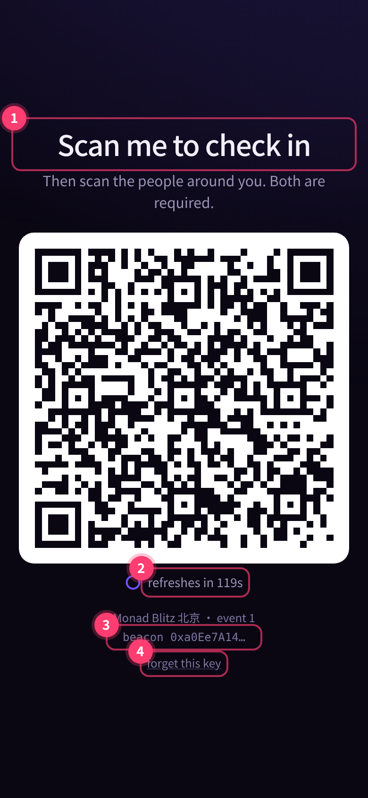
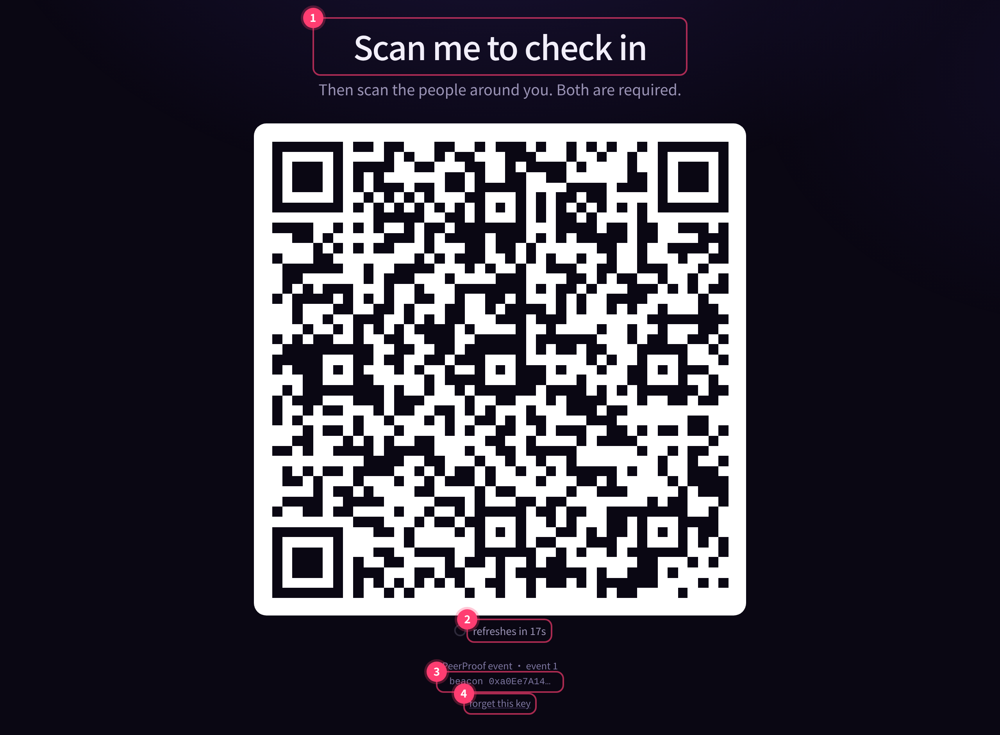

**这一屏回答**：证明「这件事发生在这个房间里」。

摆在门口的那块屏幕。显示一个**每 30 秒更换的大二维码**，参与者进门时扫它签到。

**每人整晚只扫这块屏幕一次。** 它不是「每次作证都要回头看一眼」的东西，所以这块屏幕的使用高峰集中在开场那十几分钟。

| # | 模块 | 内容 |
|---|---|---|
| ① | 主标题 | 「Scan once to check in.」副标题：「Do this when you walk in. After that the code up here stops mattering — go and meet people.」 |
| ② | 倒计时 | 「refreshes in Ns」——大二维码在它上方 |
| ③ | 信标地址 | 用来核对贴对了密钥没有 |
| ④ | `forget this key` | 换活动时清掉旧密钥 |

**截图是运行态。** 还有一个**未配置态**：一个输入框 + 「Paste the beacon key you were given when the event was created」+ `Start the display` 按钮。那一屏也要设计——主办方第一次打开看到的是它。

**它会跑在什么设备上不确定**——可能是备用手机，可能是笔记本，可能是投影仪。所以它**不能锁死手机宽度**：二维码要跟着屏幕放大（最大到视口高度的 70%），否则投出来隔几米就扫不到。

**设计要点**：这块屏幕会被远距离观看。字要大，对比要强，二维码周围留白要够。这是唯一一个「不给持有者看、给房间看」的屏。

---

### 8. 公开记录 `/verify`

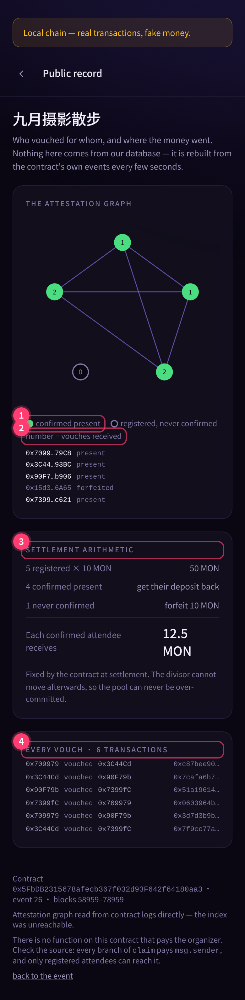
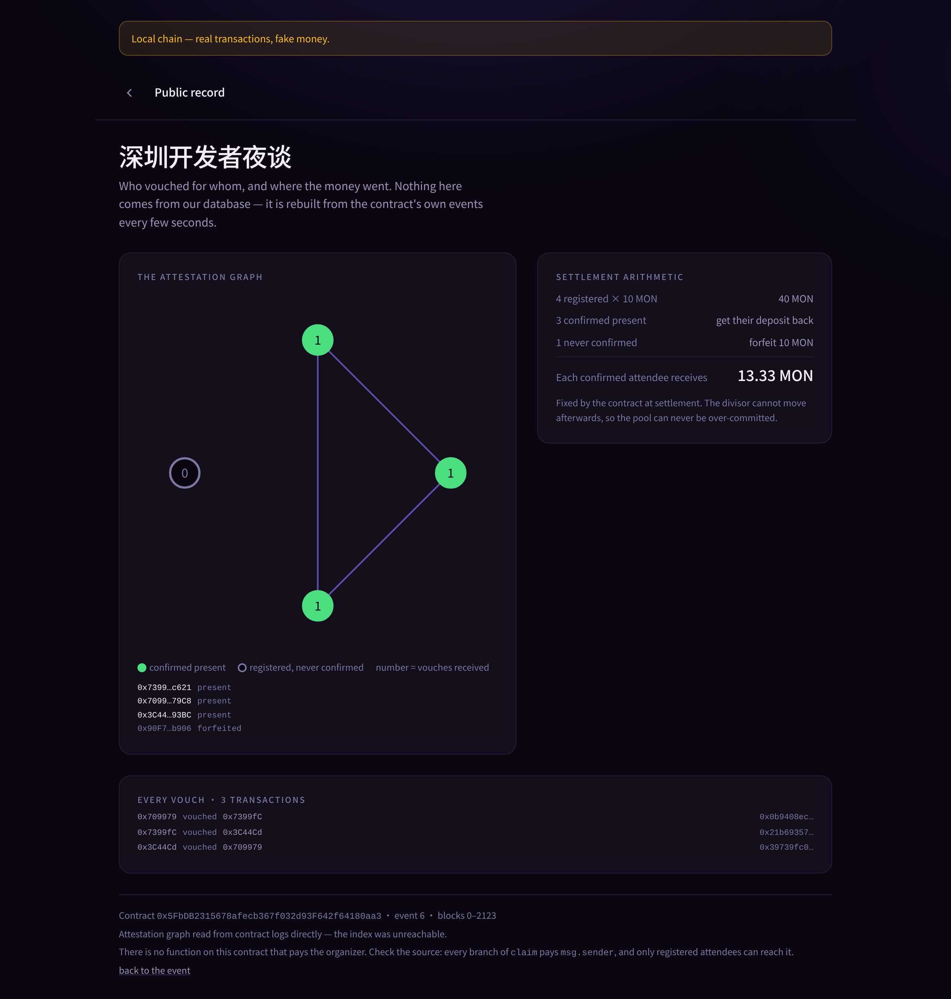

**这一屏回答**：凭什么相信结果。

| # | 模块 | 内容 |
|---|---|---|
| ① | 见证关系图 | 每个点是一个人，**每条线是一笔真实交易** |
| ② | 图例 | 实心=确认到场 / 空心=报名但未确认 / 数字=收到的见证数 |
| ③ | 结算算式 | 每人分到多少，链接到结算交易 |
| ④ | 逐笔见证列表 | 每一笔的交易哈希 |

**关系图是这个产品的论据本身**。它不是数据可视化装饰——它是「不用相信我们，每条线都能在区块浏览器上查到」的证据。

**设计要点**：这一屏要经得起评委点开逐条核对。节点密集时（50 人）的布局、线条交叉的可读性，是设计难点。

---

### 9. 余额不足 —— 活动详情的一个状态

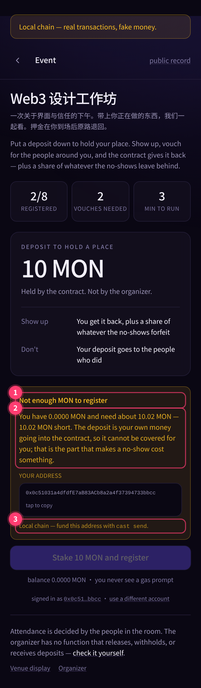
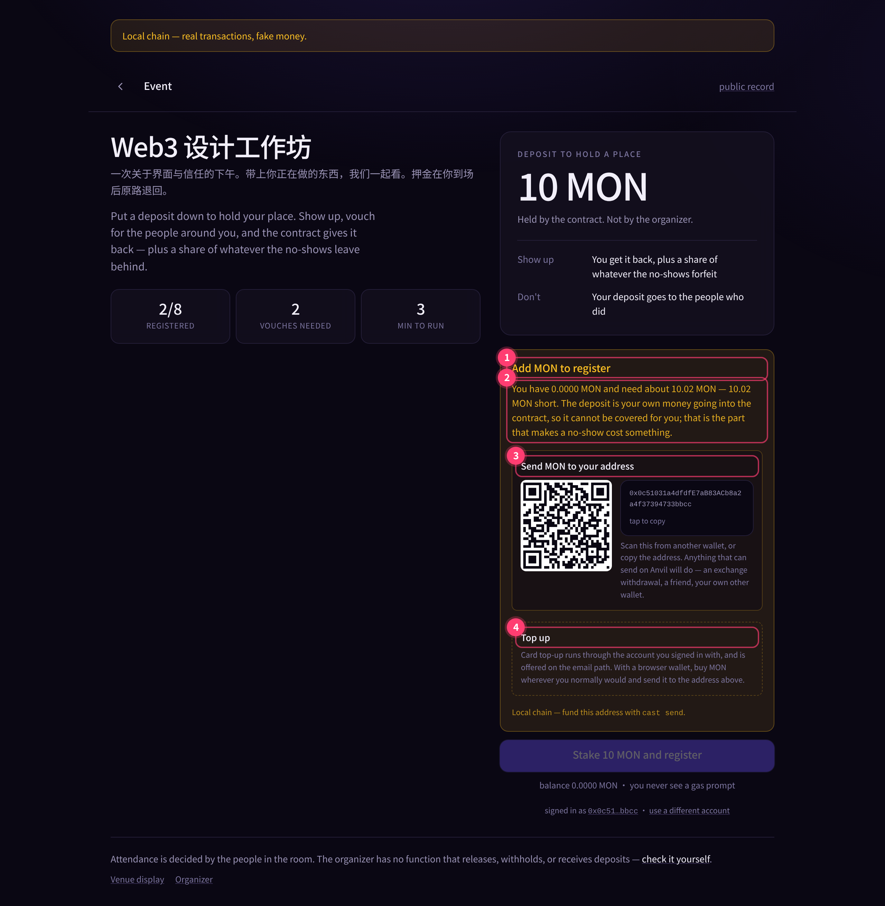

**这一屏回答**：我登录了，但我没有钱，怎么办。

这是邮箱登录留下的缺口。Privy 免去了「要有钱包」，但没有免去「要有钱」——一个从没接触过加密货币的人一键拿到账号，然后点报名失败，看起来像产品坏了。

| # | 元素 | 内容 |
|---|---|---|
| ① | 标题 | 「Add MON to register」——**是「充值」，不是「出错了」** |
| ② | 解释 | 差多少 + 「押金是你自己的钱进合约，**不能由别人代付**——正是这一点让缺席有代价」 |
| ③ | **转入区**（主体） | 「Send MON to your address」+ **地址二维码** + 可复制的完整地址 |
| ④ | **充值区**（虚线框） | 「Top up」——**邮箱登录时是一个按钮** `Top up with a card`（能点，点了弹说明）；**其他登录方式是一句说明**。截图里是后者，因为本地测试链上用的是开发密钥 |
| — | 主按钮 | **禁用**，在整块下方 |

**这一屏改过一次，原因值得写下来。**

最早这里第一眼是「领测试币」的水龙头链接。那是**我们自己测试**才会做的事——去参加读书会的人不会去领测试代币。那样排版描述的是我们的测试环境，不是用户的处境。

现在的顺序按「今天真的能走通的方式」排：

1. **转账进来**——唯一在所有网络上都成立的办法，所以给它最大的版面
2. **充值**——**能点，点了弹出一个说明窗口**
3. 水龙头——**已经从产品里拿掉了**，只在网址带 `?dev=1` 时出现。设计时当它不存在

**③ 的二维码不是装饰。** 手机上登录的人，没法把自己 42 位的地址粘进另一台设备的钱包里；扫码是现实中唯一走得通的路。编码的是 `ethereum:0x…@链号`，钱包 App 扫到会直接进「转账给」界面。

**关于水龙头，改过两次。** 第一版它是这一屏的主角；第二版降成底部两个小按钮；**现在整个移出产品**。降级不够——只要它还在屏幕上，这一屏读起来就还是「领测试币的页面」。测试网上怎么拿币，写在 README 里给测试者看，不放进产品。

**④ 这一块也改过。** 最初是一个灰色的「not yet available」标签加一段解释——**准确，但没用**：钱包空着的人没法对一句话采取行动。

**这一块前后做过三个版本，第二版是错的，值得记下来：**

| 版本 | 做法 | 问题 |
|---|---|---|
| 一 | 灰色标签 `not yet available` + 一段解释 | **准确但没用**——钱包空着的人没法对一句话采取行动 |
| 二 | 真按钮，接 Privy 的充值流程 | **更糟**（见下） |
| 三 | 真按钮，点了**弹出说明窗口** | 现在这版 |

**第二版为什么更糟**：点下去 Privy 弹出一个「Buy crypto」的付款界面，带金额输入框和货币选择，然后卡在 **「Unable to get quotes · Something went wrong. Please try again.」**。

因为没有任何服务商卖原生 MON，所以根本报不出价。但用户看到的是**一个付款界面坏掉了**，读起来像我们的产品出了故障，而且那句 "Please try again" 还在邀请他一直重试。

**不该打开一个注定走不完的流程。**

现在点下去是我们自己的说明窗口：

> **Card top-up is coming**
>
> 这里以后是刷卡支付的入口。现在还没开，原因不在我们这边：目前没有服务商能把 MON 卖进钱包。MoonPay 在 Monad 上建好了但处于暂停，Stripe 的目标链列表里没有 Monad。
>
> 在那之前，用上面那个地址——从交易所、从另一个钱包、或者别人转给你。**那个现在就能用。**
>
> [ Got it ]

代码里留了一个 `LIVE = false` 的开关，接 Privy 的那段线**还在，而且链和资产都填好了**。哪天有服务商上了 MON，把它改成 `true` 就行，**这一屏其他部分一个字都不用改**。

**边界**：真正开通之后，银行卡信息也全程在 Privy 自己的弹窗里填，**这个 app 看不到、也不索取**。设计时不要在我们这一侧画任何卡号输入框。

**只有邮箱登录的人能看到这个按钮**——充值走的是登录账号那条通道。用浏览器钱包的人看到的是一句说明：在你平常买币的地方买，然后转到上面那个地址。

**设计要点**：这个状态出现的频率会很高——每个用邮箱登录的新用户都会撞上。它不该像错误，该像「下一步做什么」。目前整块用的是橙色警告色，**这一点值得重新考虑**：充值是正常流程，不是异常。

---

### 10. 结算与领款 —— 签到屏的最终状态

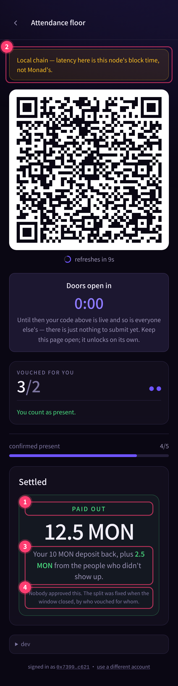
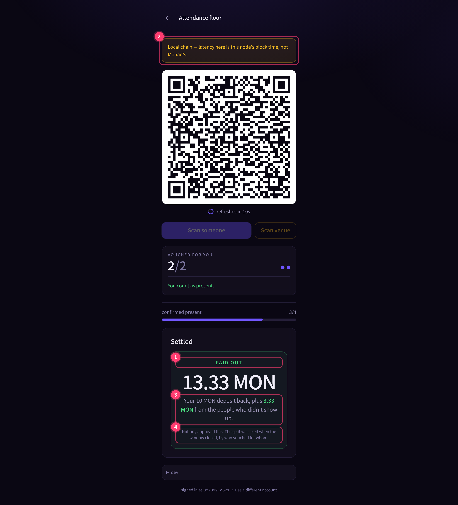

**这一屏回答**：我拿到了多少，凭什么。

**这是整个产品的情绪高点**，也是它和所有其他活动报名工具拉开差距的地方——**「到场的人拿回的比投入的多」是一个数字，不是一句承诺**。

截图里是真实的链上结果：4 人报名，3 人到场，1 人缺席。到场的人各拿回 **13.33 MON**（10 押金 + 3.33 缺席者分成）。

| # | 元素 | 内容 |
|---|---|---|
| ① | `PAID OUT` | 绿色小标 |
| ② | 大数字 | 到手总额 |
| ③ | 拆解 | 「你的 10 MON 押金退回，**外加 3.33 MON** 来自没来的人」 |
| ④ | 归属说明 | 「没有人批准这件事。分配比例在窗口关闭时就定死了，由谁给谁作证决定」 |
| — | 交易链接 | `see the transaction ↗` |

**设计要点**：这一屏之前只是一个变灰的 `Claimed` 按钮。它值得是整个流程里最有分量的一屏——**但分量要来自数字本身和可核验性，不要来自庆祝动效**。这个产品的气质是「你可以查」，不是「恭喜发财」。

上面还有两个模块也在这一屏：

- **`VOUCHED FOR YOU 2/2` + `You count as present`** —— 见证进度，达标后变绿
- **`confirmed present 3/4`** —— 全场进度条

---

## 三点五、三条登录路径（设计重点）

这是整个产品**分支最多、最容易设计漏**的地方。用户看到哪条路，**取决于他的设备有什么**——不是他选的。

### 先划清边界：哪些能设计，哪些不能

| 界面 | 归属 | 能不能改样式 |
|---|---|---|
| 身份选择区（几个按钮） | **我们的** | ✅ 完全可设计 |
| 加载中文案（`Creating your key…` 等） | **我们的** | ✅ |
| 错误提示 | **我们的** | ✅ |
| 系统刷脸/指纹弹窗 | 操作系统 | ❌ 完全不可改 |
| MetaMask 连接和签名弹窗 | MetaMask | ❌ 完全不可改 |
| Privy 登录弹窗 | Privy | 🟡 只能调主色和明暗，布局不可改 |

**设计师只需要设计第 1–3 行。** 后面三行是既成事实，但**必须知道它们存在**，因为它们打断流程、改变节奏。

---

### 路径 A：passkey（体验最好，覆盖最窄）

```
点「Create my key」
   ↓
【系统弹窗】刷脸 / 指纹          ← 不可设计
   ↓
完成。之后全程无任何弹窗
```

**只有这条路做到了「签到时零打扰」**——派生出的密钥在本地静默签名，15 秒换一次码也不会弹窗。

**支持范围**：iPhone Safari（iOS 18+）、Android Chrome。**桌面浏览器基本都不支持**（需要 WebAuthn PRF 扩展）。

---

### 路径 B：邮箱（唯一零前置条件）

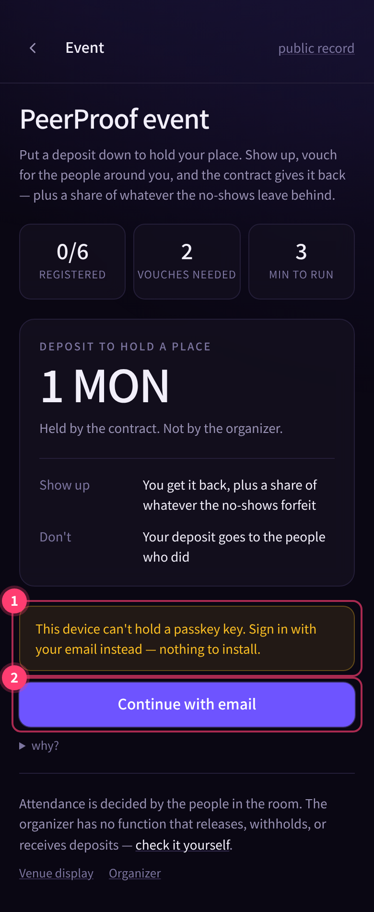
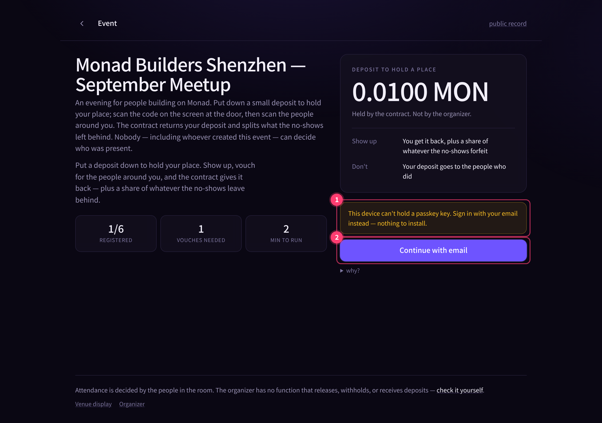

| # | 元素 | 说明 |
|---|---|---|
| ① | 黄色提示 | 「这台设备存不了 passkey。用邮箱登录——什么都不用装」 |
| ② | `Continue with email` | 主按钮 |
| — | `Use a browser wallet` | 只在检测到钱包时出现，**截图里没有**（无头浏览器没有 window.ethereum）。它自己的截图是第 11 屏 |

点下去之后是 **Privy 的弹窗**：

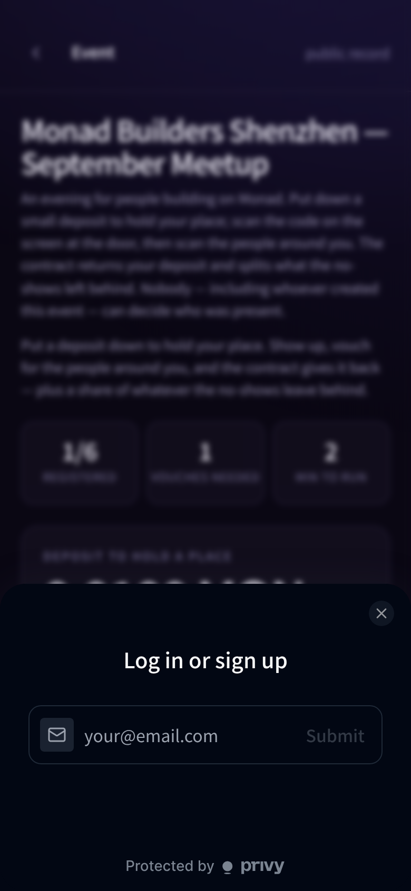
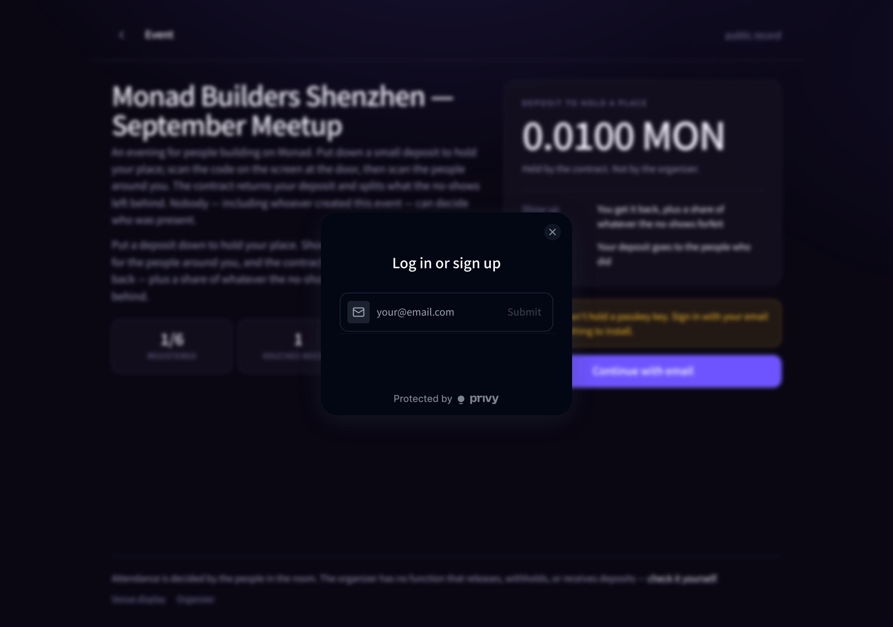

**这一屏不是我们的**，是 Privy 的组件。只能改主色（现在是 `#6e54ff`）和明暗，布局、文案、圆角都不可改。

完整流程：

```
点「Continue with email」
   ↓
【Privy 弹窗】填邮箱 → Submit     ← 只能调色
   ↓
【Privy 弹窗】填收到的验证码       ← 只能调色
   ↓
Privy 自动创建一个钱包（用户无感）
   ↓
【Privy 弹窗】Sign message        ← 只能调色 ⚠️ 见下
   ↓
完成，但钱包里是 0 MON  →  跳到第 9 屏（余额不足）
```

---

### 路径 C：浏览器钱包

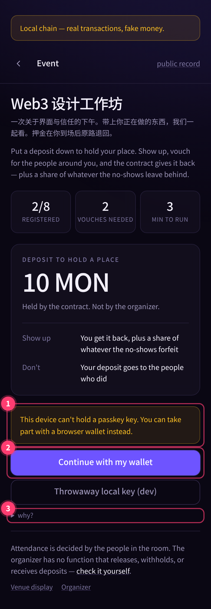
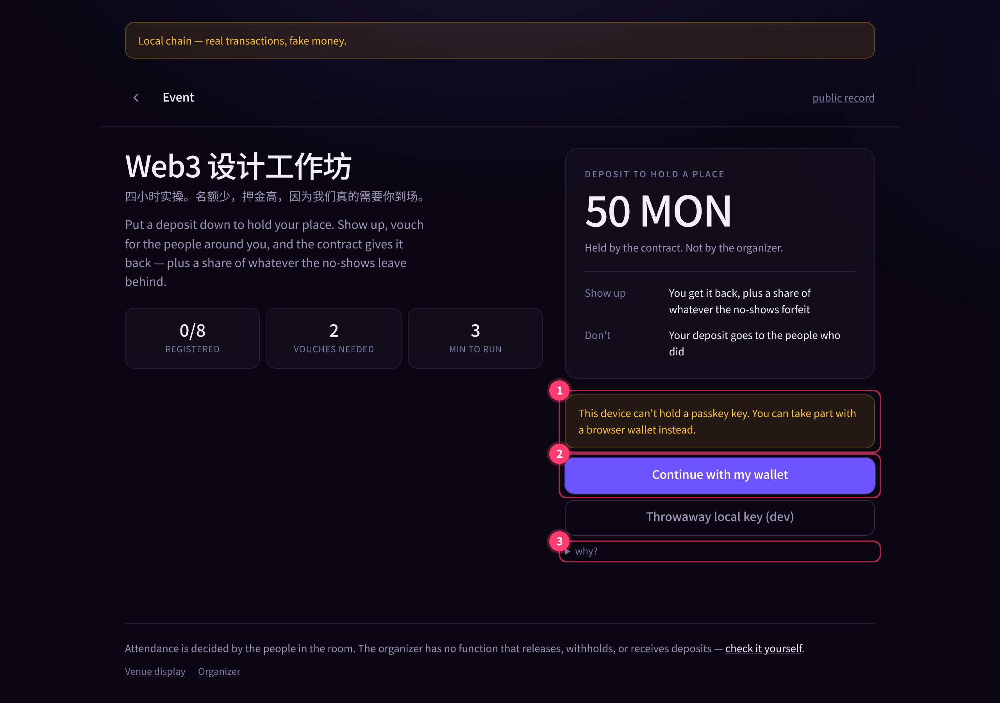

| # | 元素 | 说明 |
|---|---|---|
| ① | 黄色提示 | 「这台设备存不了 passkey。可以用浏览器钱包」 |
| ② | `Continue with my wallet` | 主按钮 |
| ③ | `why?` | 折叠的解释，点开说明为什么这台设备不行 |

```
点「Continue with my wallet」
   ↓
【MetaMask】连接账户               ← 不可设计
   ↓
【MetaMask】Sign message           ← 不可设计 ⚠️ 见下
   ↓
完成
```

---

### ⚠️ 那个「第二次签名」，两条路都有

用户刚登录完，会**再弹一次签名**，内容是：

```
PeerProof attendance key

Signing this derives the key that signs your attendance codes.
It does not authorise any transfer.

Contract: 0x289a…
Event: 4
```

**这是产品设计的一部分，不是多余步骤。** 它用一次签名派生出「签到码专用密钥」，之后扫码全程静默——**没有它，每扫一个人都要弹一次窗，15 秒一换的码就完全没法用**。

**但对用户来说这是个困惑点**：「我刚登录过了，怎么又要签？」

**设计需求**：在点击按钮之前或之后，用**我们自己的界面**解释这一步。现在完全没有铺垫，用户直接撞上一个第三方弹窗。可以是按钮下方一行小字，也可以是点击后的过渡态。文案要点：

- 这一步**不花钱、不授权转账**（弹窗自己也写了，但用户不一定看）
- 换来的是**之后扫码不再弹窗**
- 一个活动只需要签一次

---

### 路径 D：什么都没有（死路）

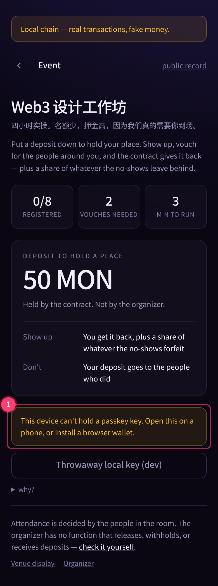
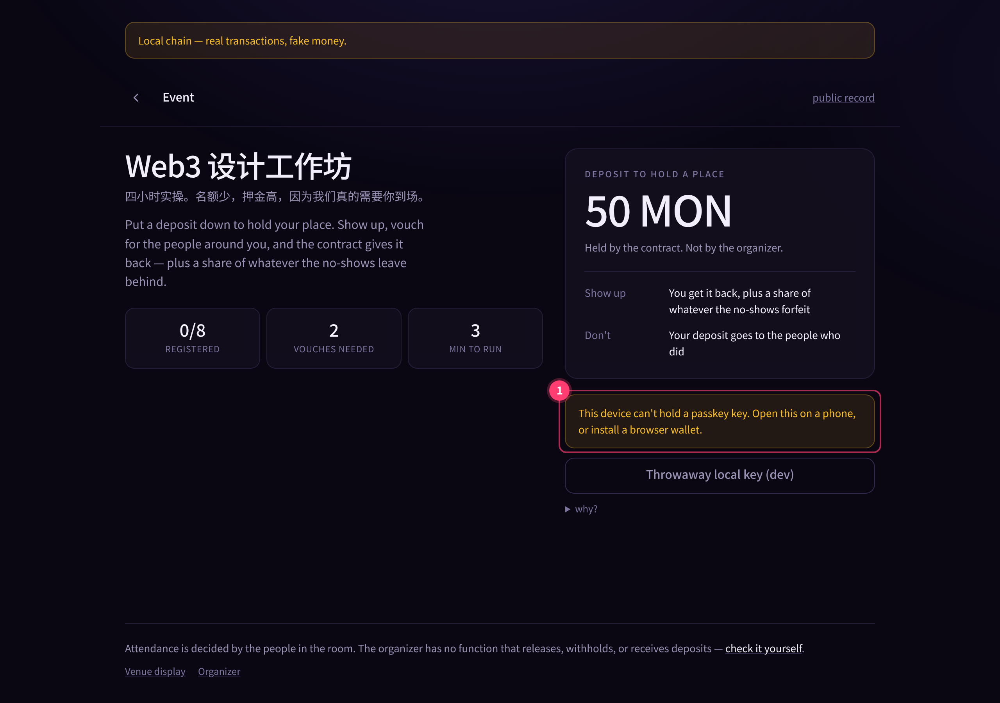

没有 passkey、没有钱包、也没配 Privy 时，页面显示：

| # | 模块 | 内容 |
|---|---|---|
| ① | 橙色提示块 | `This device can't hold a passkey key. Open this on a phone, or install a browser wallet.` |

下方还有一个折叠的 `why?`，展开是两段解释（PRF 扩展是什么、为什么钱包路径要每次确认）。**默认折叠是刻意的**——落到这一屏的人需要的是出路，不是原理。

**这是当前唯一真正的死路。** 配好 Privy 之后它不该再出现——但如果 Privy 服务挂了或者域名白名单没配对，用户就会落到这里。

**设计需求**：这一屏要**明确告诉用户去哪**，而不是只说「你不行」。现在的文案已经在做这件事，但视觉上它和普通警告长得一样，没有「这是终点，请换个方式」的分量。

---

### 一张表总结

| | passkey | 邮箱 | 钱包 |
|---|---|---|---|
| 需要什么 | 支持 PRF 的浏览器 | **什么都不需要** | 装了 MetaMask |
| 弹窗次数 | 1 次（刷脸） | 3 次（邮箱/验证码/签名） | 2 次（连接/签名） |
| 扫码时 | **零打扰** | 每次确认 | 每次确认 |
| 登录后有钱吗 | 看用户自己 | **没有**，必然撞上第 9 屏 | 通常有 |
| 谁会走这条 | 手机用户 | 没接触过加密货币的人 | 已有钱包的人 |

**设计时的排序原则**：邮箱排在钱包前面。有钱包的人两条都能走，**没钱包的人只有邮箱这一条**。

---

## 四、还没做的部分

原来列了五处缺口，三处已补（第 9、10 屏，以及充值入口文案）。剩下两处**没有截图，因为还不存在**——下面是设计需求，不是描述。

### A. 报名成功的确认时刻

**现在是什么样**：点「Stake 50 MON and register」→ 交易上链 → 按钮区直接换成「Go to the floor」。押金离开钱包这件事**没有任何交代**。

**为什么要做**：这是用户第一次真的掏钱。50 MON 从钱包出去了，界面却像什么都没发生。**在一个主打「钱不在主办方手里」的产品里，钱去哪了这一刻必须说清楚。**

**必须传达**（按重要性）：

1. **钱到了合约，不是主办方** —— 这是产品的全部主张，在掏钱这一刻说最有力
2. **接下来该干什么** —— 报名截止时间、见证窗口什么时候开
3. **怎么拿回来** —— 到场并被 N 个人作证

**可用数据**：交易哈希、押金额、区块浏览器链接、报名截止时间、见证窗口开始时间、需要几次见证、当前已报名人数。

**约束**

- 这是**一次性时刻**，刷新后就该变成常规的「已报名」状态，不能每次进页面都弹
- 手机上单手操作，主按钮（去签到屏）要落在拇指区
- **别用庆祝动效**。这个产品的气质是「你可以查」，礼花和这个基调冲突
- 交易哈希要能点开，**可核验性是这里的情绪来源**

**参考现有元素**：第 10 屏（结算）是同一类「钱动了」的时刻，可以呼应，但那是收钱、这是付钱，情绪不同。

---

### B. 见证成功的即时反馈

**现在是什么样**：扫到一个人 → 交易上链 → 顶部飘一个 toast（2.6 秒消失）→ `VOUCHED FOR YOU` 的数字 +1。

**为什么要做**：**这是 demo 视频里最关键的一个镜头**。整个「为什么必须是 Monad」的论证就靠这一下——A 扫了 B，两台设备在一秒内同时更新，屏幕上显示真实上链耗时。现在这个瞬间在视觉上完全没有分量。

**必须传达**

1. **对方是谁** —— 扫到的地址（缩写形式）
2. **上链耗时** —— 真实毫秒数，这是硬证据，**必须醒目**
3. **双方都得分** —— 一次扫码，两个人的计数都 +1，这是合约的设计，界面上要体现
4. **离达标还差几个**

**可用数据**：交易哈希、确认耗时（毫秒）、对方地址、自己当前收到的见证数 / 需要数、对方的新计数。

**约束**

- **必须在 15 秒内看完**，因为码 15 秒一换，用户马上要扫下一个
- 会场光线可能很差，**对比度要高**
- 会被摄像机拍，**数字要大到能上镜**
- 失败也要有对应状态：码过期、重复扫同一个人、**还没在门口签到**
- 不能挡住摄像头取景框太久——扫完还要接着扫

**这一屏的成败标准**：把手机屏幕录下来，单看这几秒，能不能让人相信「这真的是 300 毫秒上链」。

---

## 五、视觉现状

现在这套是我按 Monad 品牌色搭的，**可以整体推翻**。

| | |
|---|---|
| 主色 | `#6e54ff`（Monad 品牌紫） |
| 背景 | `#0a0713` |
| 卡片 | `#14101f` |
| 分割线 | `#241e38` |
| 正文 | `#f2effa` |
| 次要文字 | `#9a93b5` |
| 最弱文字 | `#7d76a0`（对比度 4.72:1，刚过 WCAG AA） |

**两个约束请保留**：

- **正文对比度不低于 4.5:1**。会场光线差，而且要上镜
- **触控目标不小于 44px**。签到屏是单手站着操作的

---

## 六、给设计的一句话

这个产品的全部主张是「**不用相信任何人，自己验证**」。

所以视觉上应该**克制、可信、像工具**，不要像营销页。每一处「我们承诺」都应该换成「你可以查」——界面上已经有好几个这样的链接，它们比任何文案都重要。
